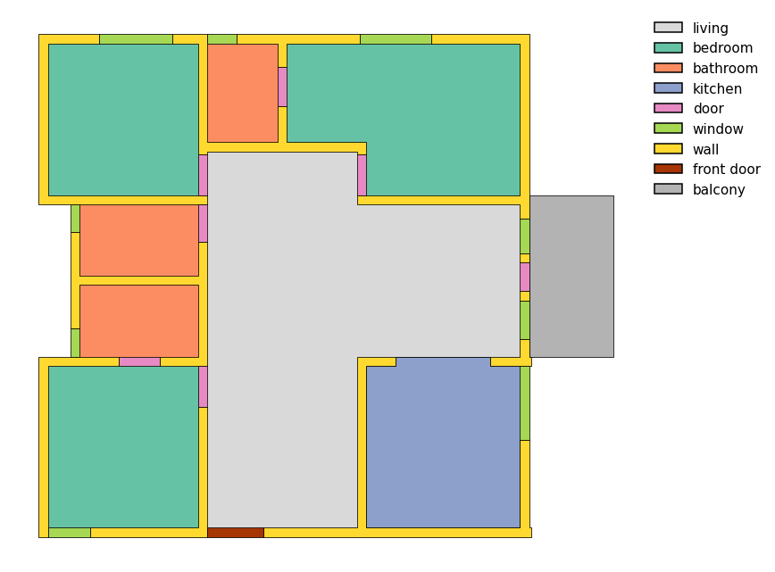
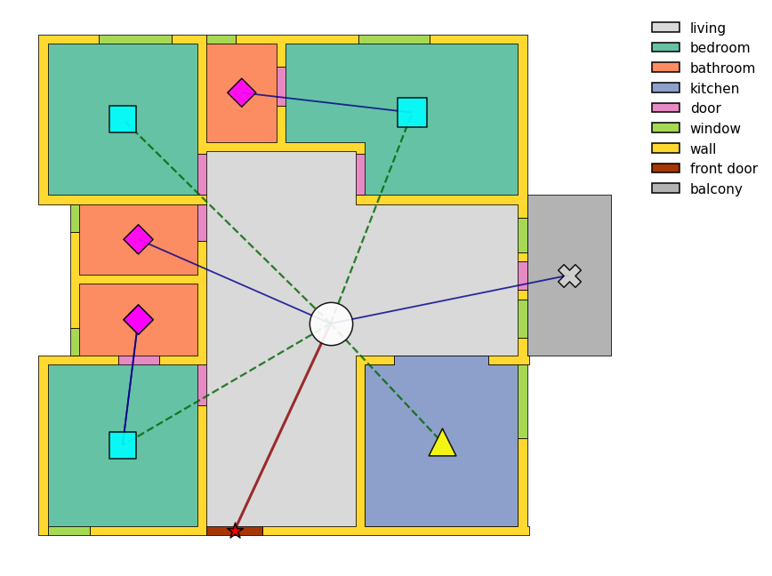

# ResPlan: A Large-Scale Vector-Graph Dataset of Residential Floor Plans

[](https://arxiv.org/abs/2508.14006)

This repository accompanies the paper:

**[ResPlan: A Large-Scale Vector-Graph Dataset of 17,000 Residential Floor Plans](https://arxiv.org/abs/2508.14006)**  
*Mohamed Abouagour, Eleftherios Garyfallidis*  

---


## Overview

ResPlan introduces a **large-scale dataset of 17,000 structurally rich and realistic residential floor plans** designed to advance research in **spatial AI, robotics, and generative modeling**.

- **High fidelity** annotations of architectural elements: walls, doors, windows, balconies.  
- **Functional spaces**: kitchens, bedrooms, bathrooms, living rooms.  
- **Dual representation**: vector geometries + graph structures.  
- **Open-source pipeline** for geometry cleaning, alignment, and annotation refinement.  
- **Applications**: reinforcement learning, robotics navigation, generative AI, VR/AR simulations, game design.  

---

## Example Visualization

Here is a sample floor plan rendered with `plot_plan`:



And here is the same plan with its graph overlay:




## Contents

- `ResPlan_demo.ipynb` – Example Jupyter notebook showing how to:
  - Load and visualize plans
  - Convert geometries to raster masks
  - Apply augmentations (rotate, flip, scale)
  - Convert plans into graph representations
- `resplan_utils.py` – Helper utilities for:
  - Geometry operations
  - Augmentations
  - Mask conversions
  - Plotting plans and graphs:contentReference[oaicite:0]{index=0}
- `ResPlan.zip` – Containing the PKL file of the dataset (unzip first).

---

## Usage

Clone the repository and install dependencies:

```bash
git clone https://github.com/m-agour/ResPlan.git
cd ResPlan

pip install shapely geopandas matplotlib networkx numpy opencv-python

```
then, run `ResPlan_demo.ipynb`
